<p align="center">
  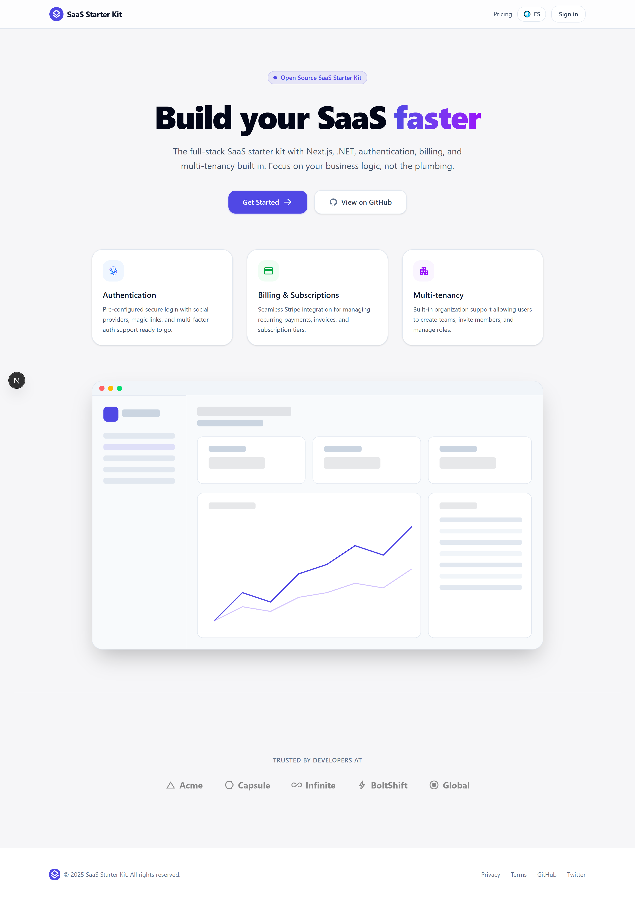
</p>

<h1 align="center">SaaS Starter Kit</h1>

<p align="center">
  The full-stack SaaS starter kit with Next.js, .NET, authentication, billing, and multi-tenancy built in.<br/>
  Focus on your business logic, not the plumbing.
</p>

<p align="center">
  <a href="https://github.com/Monkey-D-Luisi/saas-template/actions/workflows/ci.yml"></a>
  <a href="https://github.com/Monkey-D-Luisi/saas-template/actions/workflows/publish.yml"></a>
  <a href="LICENSE"></a>
</p>

<p align="center">
  
  
  
  
  
  
  
  
</p>

---

## Table of Contents

- [Why This Template](#why-this-template)
- [Screenshots](#screenshots)
- [Architecture](#architecture)
- [What's Included](#whats-included)
- [Feature Matrix](#feature-matrix)
- [Tech Stack](#tech-stack)
- [Quick Start](#quick-start)
- [Documentation](#documentation)
- [Comparison](#comparison)
- [License](#license)

---

## Why This Template

Most SaaS starter kits give you either a great frontend **or** a great backend. This one gives you both — plus the infrastructure, CI/CD, and cloud deployment pipeline to go from idea to production.

**What makes it different:**

- **Two independent .NET microservices** with Clean Architecture + CQRS — not a monolith you'll need to split later
- **Real multi-tenancy** with tenant-isolated queries, RBAC (owner/admin/member), and cross-tenant protection
- **Production billing** with Stripe subscriptions, one-time payments, customer portal, and webhook processing
- **AI-powered features** with OpenAI integration and a working smart-fill UI
- **Cloud-ready from day one** — Terraform modules for GCP Cloud Run, Cloud SQL, Redis, and Secret Manager
- **Full CI/CD pipeline** — build, test, publish Docker images to GHCR, deploy to staging/production, and rollback
- **Internationalization** built in (English + Spanish) with localized email templates

---

## Screenshots

| Landing Page | Login |
|:---:|:---:|
|  | 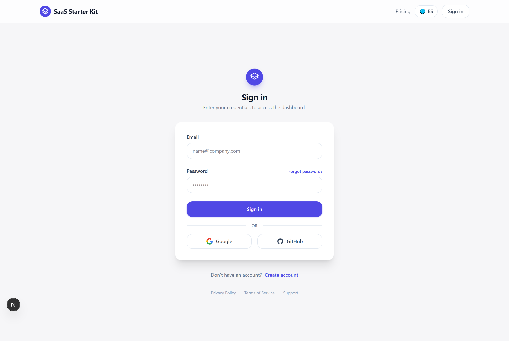 |

| Pricing | Organizations |
|:---:|:---:|
| 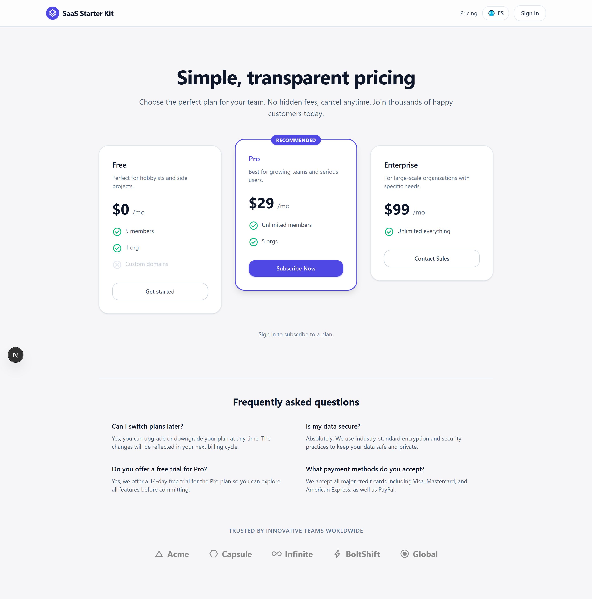 | 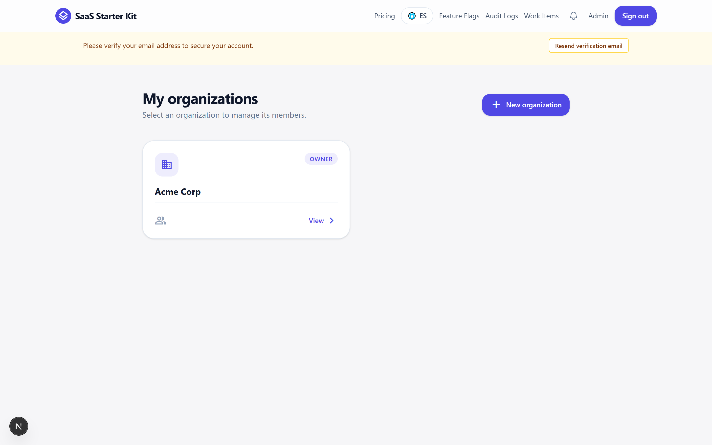 |

| Members & Invitations | Work Items |
|:---:|:---:|
| 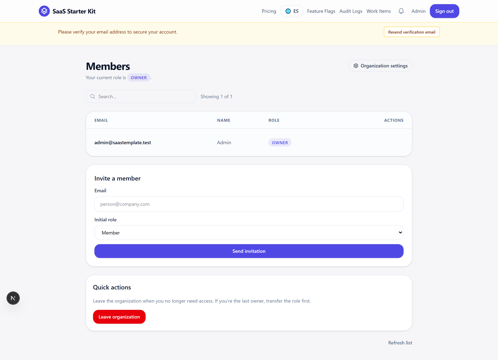 | 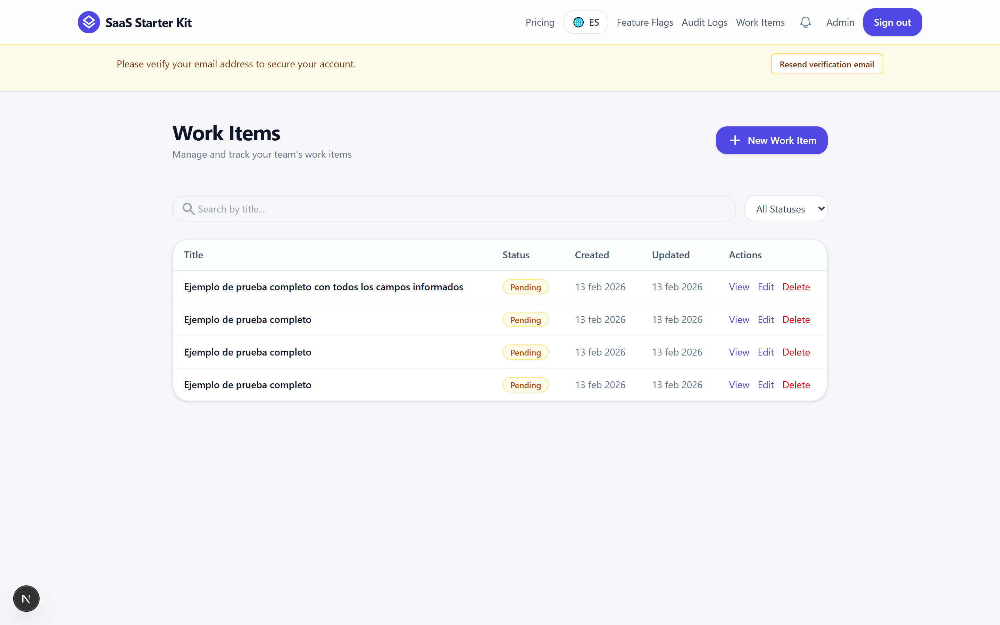 |

| Feature Flags | Billing |
|:---:|:---:|
| 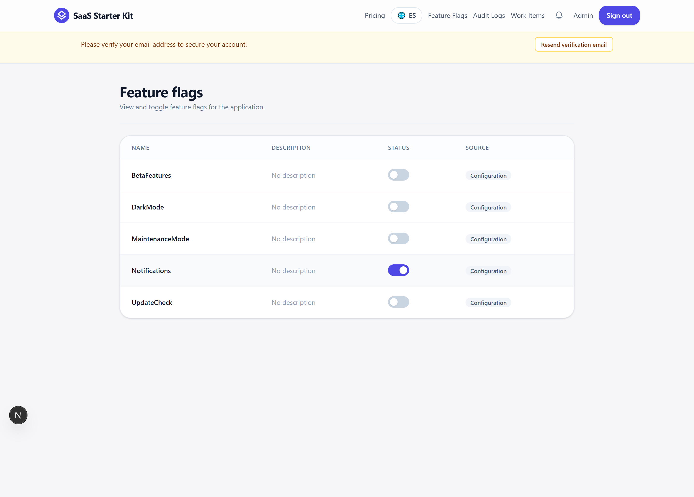 | 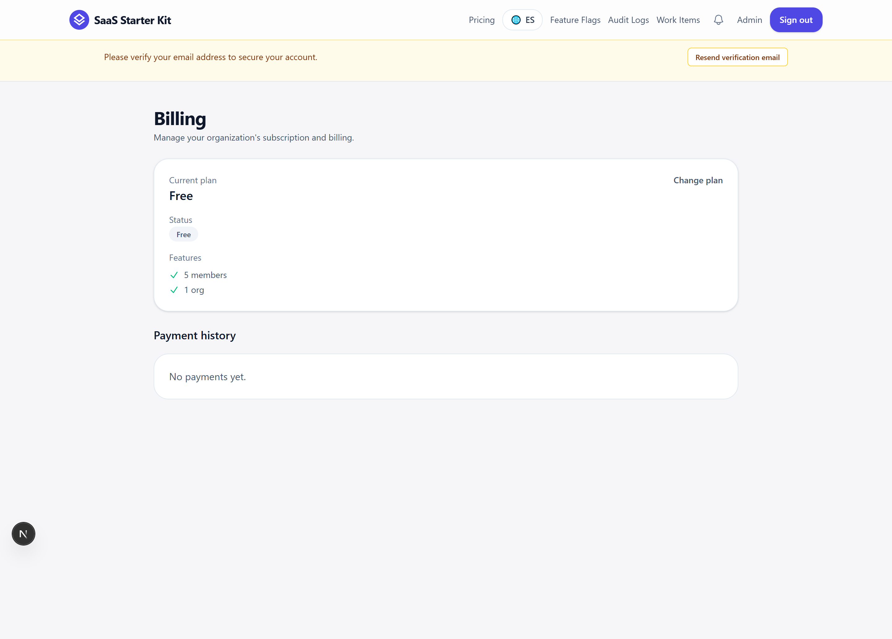 |

| Audit Logs | Account Settings |
|:---:|:---:|
| 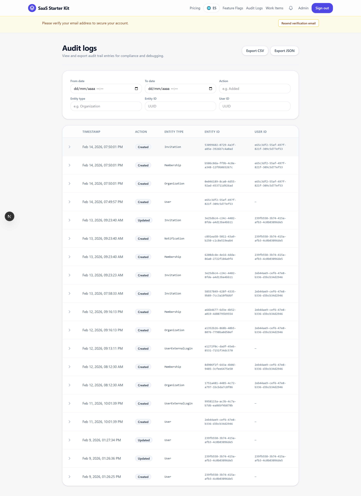 | 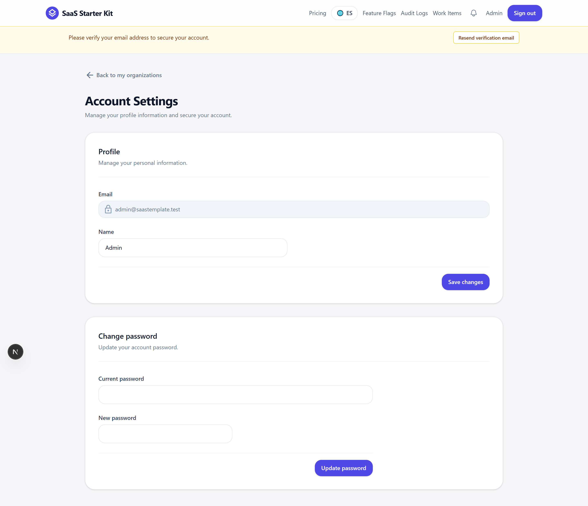 |

---

## Architecture

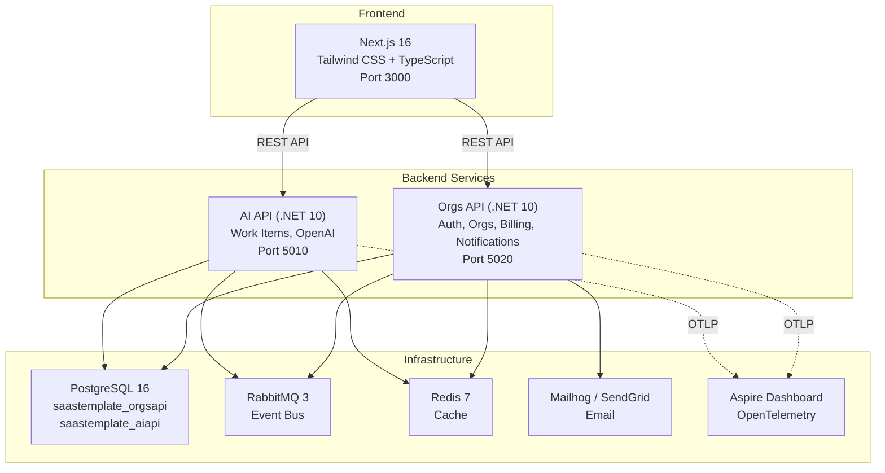

Both .NET services follow **Clean Architecture + CQRS** with MediatR:

```
src/
  *.Domain/          Pure business logic, entities, domain events
  *.Application/     Commands, queries, handlers, interfaces
  *.Infrastructure/  EF Core, RabbitMQ, Redis, external services
  *.Api/             Controllers, middleware, configuration, DTOs
```

---

## What's Included

### Authentication & Security
- Email/password registration and login
- OAuth social login (Google + GitHub)
- JWT token-based authentication
- Email verification flow with localized templates
- Password reset with secure token fingerprinting
- CSRF double-submit cookie protection
- Per-endpoint rate limiting
- Account deletion (GDPR-ready)

### Multi-tenancy & Organizations
- Create and manage organizations
- Role-based access control (Owner / Admin / Member)
- Email invitations with acceptance flow
- Tenant-isolated database queries (EF Core global filters)
- Cross-tenant injection protection

### Billing (Stripe)
- Subscription plans (Free / Pro / Enterprise)
- One-time payment support
- Stripe Checkout and Customer Portal integration
- Webhook event processing with idempotency
- Payment history tracking
- Entitlement service for plan-based feature gating
- Free mode (`Billing__Mode=free`) for development without Stripe

### AI Integration
- OpenAI SDK integration (configurable model)
- Smart Fill: parse natural language into structured work item fields
- Graceful degradation when AI API is unavailable

### Admin Dashboard
- Feature flag management with toggle UI
- Audit log viewer with filters, pagination, and CSV/JSON export
- Version endpoint for deployment tracking

### Notifications
- In-app notification system
- Notification bell with unread count
- Mark as read / mark all as read

### Internationalization (i18n)
- English and Spanish out of the box
- `next-intl` integration with locale-based routing
- Language switcher in the header
- All 6 email templates localized (en + es)

### Email System
- SMTP (Mailhog for development) and SendGrid support
- Razor template engine with shared layout
- 6 transactional email types: Welcome, Email Verification, Password Reset, Invitation, Member Removed, Role Change

### Infrastructure
- Docker Compose for local development (one command)
- PostgreSQL 16 with separate databases per service
- RabbitMQ for async messaging (outbox pattern)
- Redis for distributed caching
- OpenTelemetry with Aspire Dashboard (traces, metrics, logs)
- Health check endpoints (`/health/live`, `/health/ready`)
- Auto-migrations on startup

### CI/CD & DevOps
- GitHub Actions: build, test, publish, deploy, rollback (7 workflows)
- Change detection — only runs jobs for modified services
- Docker images published to GitHub Container Registry (GHCR)
- Trivy vulnerability scanning on container images
- NuGet vulnerability audit on every build
- Coverage thresholds (60%) enforced in CI
- Semantic release with conventional commits
- E2E smoke tests with Playwright
- Dependabot for automated dependency updates

### Cloud Deployment
- Terraform modules for Google Cloud Platform
- Cloud Run (serverless containers)
- Cloud SQL (managed PostgreSQL)
- Memorystore (managed Redis)
- Secret Manager for credentials
- VPC networking with private connectivity
- OIDC Workload Identity Federation (no service account keys)
- Staging and production environments
- One-click rollback workflow

### Developer Experience
- One-command setup (`make dev` / `bootstrap.ps1`)
- Cross-platform scripts (Bash + PowerShell)
- Module scaffolding script (generates Clean Architecture vertical slices)
- Comprehensive `.env.example` with documentation
- Swagger/OpenAPI for both services
- 6 test projects (unit, integration, architecture) + frontend tests + E2E

---

## Feature Matrix

| Category | Feature | Status |
|----------|---------|--------|
| **Auth** | Email/password login | Included |
| | OAuth (Google + GitHub) | Included |
| | Email verification | Included |
| | Password reset | Included |
| | Account deletion | Included |
| | CSRF protection | Included |
| | Rate limiting | Included |
| **Orgs** | Multi-tenancy | Included |
| | RBAC (owner/admin/member) | Included |
| | Email invitations | Included |
| | Tenant isolation | Included |
| **Billing** | Stripe subscriptions | Included |
| | One-time payments | Included |
| | Customer portal | Included |
| | Webhook processing | Included |
| | Free mode | Included |
| **AI** | OpenAI integration | Included |
| | Smart Fill (NLP parsing) | Included |
| **Admin** | Feature flags | Included |
| | Audit logs + export | Included |
| **Comms** | In-app notifications | Included |
| | Transactional emails (6 types) | Included |
| **i18n** | English + Spanish | Included |
| | Localized email templates | Included |
| **Infra** | Docker Compose | Included |
| | Terraform (GCP) | Included |
| | CI/CD (GitHub Actions) | Included |
| | E2E tests (Playwright) | Included |
| | OpenTelemetry | Included |

---

## Tech Stack

### Frontend

| Technology | Version | Purpose |
|------------|---------|---------|
| Next.js | 16 | React framework with App Router |
| React | 19 | UI library |
| TypeScript | 5 | Type safety |
| Tailwind CSS | 4 | Utility-first styling |
| next-intl | 4 | Internationalization |
| Zod | 4 | Schema validation |
| React Hook Form | 7 | Form management |
| Vitest | 4 | Unit testing |
| Playwright | 1.58 | E2E testing |

### Backend

| Technology | Version | Purpose |
|------------|---------|---------|
| .NET | 10 | Application framework |
| Entity Framework Core | 10 | ORM with PostgreSQL |
| MediatR | 12 | CQRS mediator |
| FluentValidation | 11 | Request validation |
| Stripe.net | 50 | Payment processing |
| OpenAI SDK | 2.8 | AI integration |
| RabbitMQ.Client | 7 | Message broker |
| StackExchange.Redis | 2.10 | Distributed cache |
| RazorLight | 2.3 | Email templates |
| SendGrid | 9 | Email delivery |
| OpenTelemetry | 1.11 | Observability |
| BCrypt.Net | 4 | Password hashing |

### Infrastructure

| Technology | Version | Purpose |
|------------|---------|---------|
| PostgreSQL | 16 | Primary database |
| RabbitMQ | 3 | Message broker |
| Redis | 7 | Caching layer |
| Docker Compose | v2 | Local orchestration |
| Terraform | 1.9 | Infrastructure as code |
| GCP Cloud Run | — | Serverless deployment |

---

## Quick Start

**Prerequisites:** [.NET 10 SDK](https://dotnet.microsoft.com/download) &middot; [Node.js 22+](https://nodejs.org/) &middot; [Docker Desktop](https://www.docker.com/products/docker-desktop/)

**One command (recommended):**

```bash
# macOS / Linux
git clone https://github.com/Monkey-D-Luisi/saas-template.git
cd saas-template
make dev
```

```powershell
# Windows
git clone https://github.com/Monkey-D-Luisi/saas-template.git
cd saas-template
.\scripts\bootstrap.ps1
```

This checks prerequisites, creates `.env` from `.env.example`, starts all services in Docker, waits for health checks, and opens the browser at `http://localhost:3000`.

See the [Quick Start Guide](QUICKSTART.md) for detailed setup including Stripe, OAuth, and deployment configuration.

---

## Documentation

| Document | Description |
|----------|-------------|
| [Quick Start Guide](QUICKSTART.md) | Clone to running app — prerequisites, setup, Stripe, OAuth, first deployment |
| [Developer Cookbook](docs/cookbook.md) | 8 recipes for extending the template — add entities, commands, endpoints, pages, modules, locales, feature flags, emails |
| [Configuration Guide](docs/configuration.md) | All environment variables explained with examples |
| [Production Hardening](docs/production-hardening.md) | Secret rotation procedures and security checklist |
| [Recovery Runbook](docs/recovery-runbook.md) | PITR database recovery, service rollback, and DLQ replay procedures |
| [Licensing Guide](docs/licensing-guide.md) | License terms, permitted use, and compliance |

---

## Comparison

How does this template compare to popular alternatives?

| Feature | SaaS Starter Kit | ShipFast | SaaS Pegasus | Next.js SaaS Boilerplate |
|---------|:---:|:---:|:---:|:---:|
| **Frontend** | Next.js 16 | Next.js | Django templates | Next.js |
| **Backend** | .NET 10 (2 microservices) | Next.js API routes | Django | Next.js API routes |
| **Architecture** | Clean Architecture + CQRS | Monolith | Monolith | Monolith |
| **Database** | PostgreSQL (EF Core) | MongoDB / Supabase | PostgreSQL (Django ORM) | PostgreSQL (Prisma) |
| **Auth** | JWT + OAuth + email verify | NextAuth | Django allauth | NextAuth |
| **Multi-tenancy** | Tenant-isolated queries | No | Row-level | No |
| **Billing** | Stripe (subs + one-time) | Stripe / Lemon Squeezy | Stripe | Stripe |
| **AI Integration** | OpenAI SDK + smart-fill UI | No | No | No |
| **Feature Flags** | Built-in toggle system | No | No | No |
| **Audit Logs** | Full audit trail + export | No | No | No |
| **Notifications** | In-app notification system | No | No | No |
| **Email** | Razor templates + SendGrid | Mailgun | Django email | React Email |
| **i18n** | next-intl (en + es) | No | Django i18n | No |
| **Observability** | OpenTelemetry + Aspire | No | No | No |
| **IaC** | Terraform (GCP) | Vercel | Various | Vercel |
| **CI/CD** | 7 GitHub Actions workflows | Basic | Basic | Basic |
| **E2E Tests** | Playwright | No | Playwright | No |
| **Module Scaffolding** | PowerShell/Bash script | No | Django management commands | No |

---

## Project Structure

```
saas-template/
├── apps/web/              Next.js 16 + Tailwind CSS frontend
├── services/
│   ├── ai-api/            .NET 10 — AI capabilities, work items
│   └── orgs-api/          .NET 10 — Auth, orgs, billing, notifications
├── infra/
│   └── terraform/         GCP infrastructure modules
├── scripts/               Cross-platform dev scripts (Bash + PowerShell)
├── .github/               CI/CD workflows, PR templates, Dependabot
├── docs/                  Guides, cookbook, runbooks
├── docker-compose.yml     Local development stack
├── Makefile               One-command shortcuts
└── .env.example           All configuration variables documented
```

---

## Development Scripts

| Script | Description |
|--------|-------------|
| `make dev` / `bootstrap.ps1` | One-command setup: prerequisites, `.env`, start services, health checks, open browser |
| `dev-up.sh` / `dev-up.ps1` | Start Docker stack. Use `--infra-only` for infrastructure only |
| `dev-down.sh` / `dev-down.ps1` | Stop all containers (preserves data) |
| `dev-reset.sh` / `dev-reset.ps1` | Reset all data volumes |
| `scaffold-module.ps1` | Generate Clean Architecture vertical slice in a .NET service |
| `seed-dev.sh` | Create sample org with invitation for testing |

---

## Testing

```bash
# Backend (6 test projects: unit + integration + architecture per service)
dotnet test services/ai-api/SaasTemplate.AiApi.sln
dotnet test services/orgs-api/SaasTemplate.OrgsApi.sln

# Frontend (Vitest)
cd apps/web && npm test

# E2E (Playwright — requires running stack)
cd apps/web && npx playwright test
```

---

## License

This is proprietary software. See [LICENSE](LICENSE) for the full license text and [EULA](EULA.md) for the End User License Agreement.

**Permitted:** Use, modify, and deploy for your own SaaS products (unlimited projects, single seat).
**Restricted:** Redistribution, public repos, competing template sales.

See the [Licensing Guide](docs/licensing-guide.md) for details.
